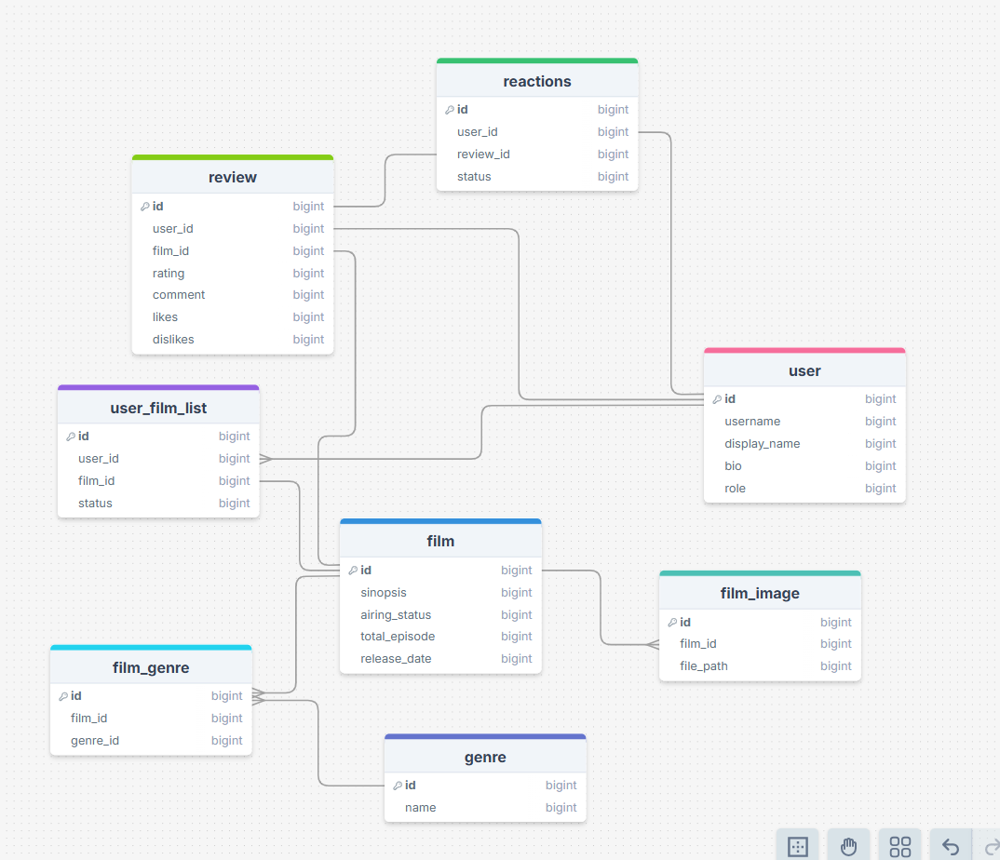

# Film Management API

Film Management API. Api ini menggunakan design pattern clean arsitektur yang memecah layer-layernya menjadi 3 bagian yaitu controller->service->repository

## Fitur Utama
- **Autentikasi Pengguna** (Registrasi & Login)


## Teknologi yang Digunakan
- **Golang** (Gin Framework)
- **GORM** (ORM untuk database)
- **PostgreSQL** (Database utama)
- **UUID & ULID** (Untuk identifikasi unik)
- **JWT** (Autentikasi Token)

## Struktur Database (Tabel Utama)



> NOTE: tipe data di tabel belum di sesuaikan

1. **Users** - Menyimpan data pengguna

## Getting Started
### 1. Clone Repository
```bash
git clone https://github.com/AzkaAzkun/mini-threads-api.git
cd mini-threads-api
```

### 2. Install Dependencies
```bash
go mod tidy
```

### 3. Konfigurasi Environment
Buat file `.env` dan atur variabel yang diperlukan seperti berikut:
```env
DB_HOST = localhost
DB_USER = postgres
DB_PASS = password
DB_NAME = db
DB_PORT = 5432
API_KEY = your_secret
```

### 4. Jalankan Server

```bash
make run
```

or

```bash
go run cmd/app/main.go
```

Server akan berjalan di `http://localhost:8090`

## Endpoint API
Untuk list endpoint silahkan mengakses dokumentasi [ini](https://documenter.getpostman.com/view/34227976/2sAYkKGwzT)

## Kontribusi
Jika ingin berkontribusi, silakan fork repository ini dan buat pull request dengan perubahan yang diusulkan.

## Lisensi
Proyek ini menggunakan lisensi **MIT**.

---
**Author**: [Azka Rizqullah R.](https://github.com/AzkaAzkun)

